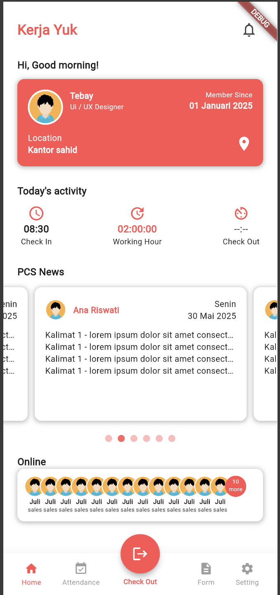
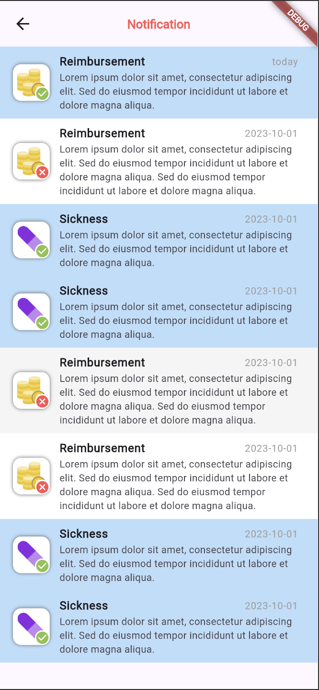

# Flutter Application




## Installation

### Requirements
- Flutter 3.0.0 or later
- Dart 2.17.0 or later
- Android Studio (for Android) or Xcode (for iOS)

### Setup

1. Install Flutter:
```bash
git clone https://github.com/flutter/flutter.git -b stable
export PATH="$PATH:`pwd`/flutter/bin" 
```

2. Verify installation:
```bash
flutter doctor
```

3. Clone this repository:
```bash
git clone https://github.com/YOUR_USERNAME/YOUR_REPO.git
cd YOUR_REPO
```

4. Get dependencies:
```bash
flutter pub get
```


### Running the App

Android:
```bash
flutter run -d android
```

Android:
```bash
flutter run -d ios
```

Android:
```bash
flutter run -d chrome
```
